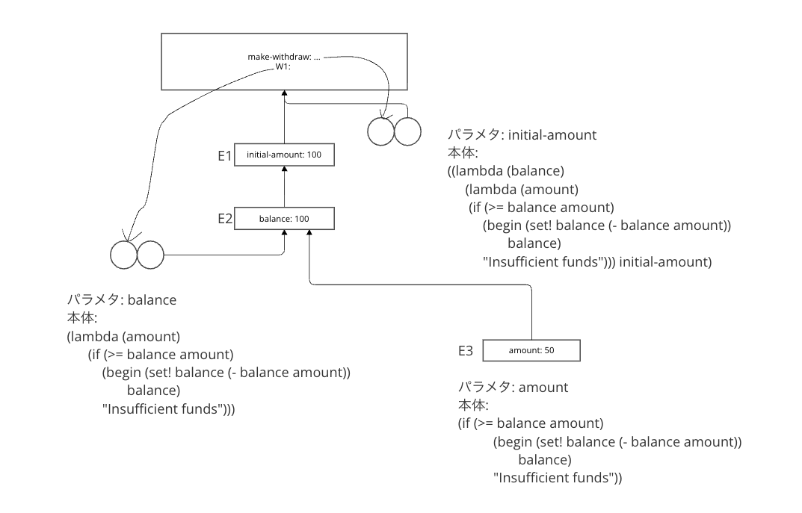

構文シュガーを元に戻すと、以下のように書き直すことができる。

```racket
(define (make-withdraw initial-amount)
  ((lambda (balance)
     (lambda (amount)
      (if (>= balance amount)
          (begin (set! balance (- balance amount))
                 balance)
          "Insufficient funds"))) initial-amount)
  )
  ```

これについて環境モデルを書く。


(define W1 (make-withdraw 100))の評価の結果


E2のラムダ式は手続きを作るためにラムダ式を評価した環境がE1なので、E1へのポインタを持つ。


手続きオブジェクトW1を作用させて作り出される環境



E2のラムダ式を評価するための新たな環境E3が作られる。

(define W2 (make-withdraw 100))を使い二番目のオブジェクトを作り出す.


環境が入れ子になる以外の違いはない。