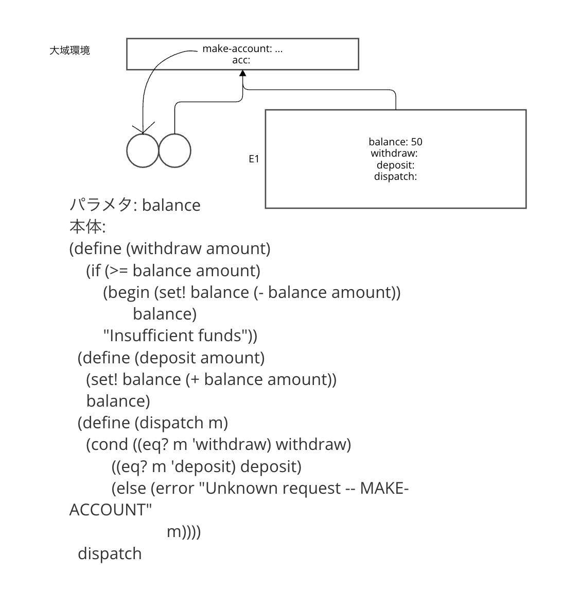
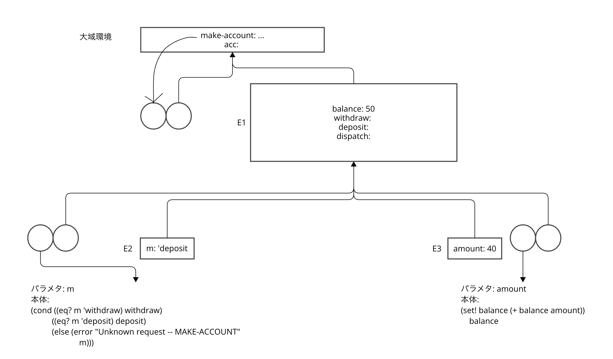
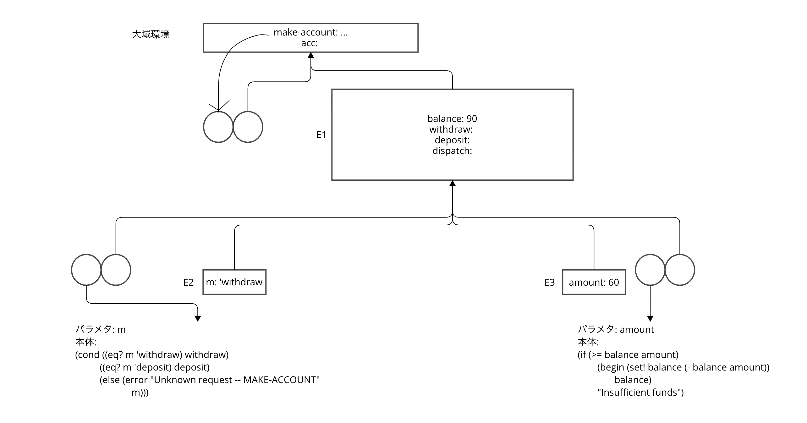
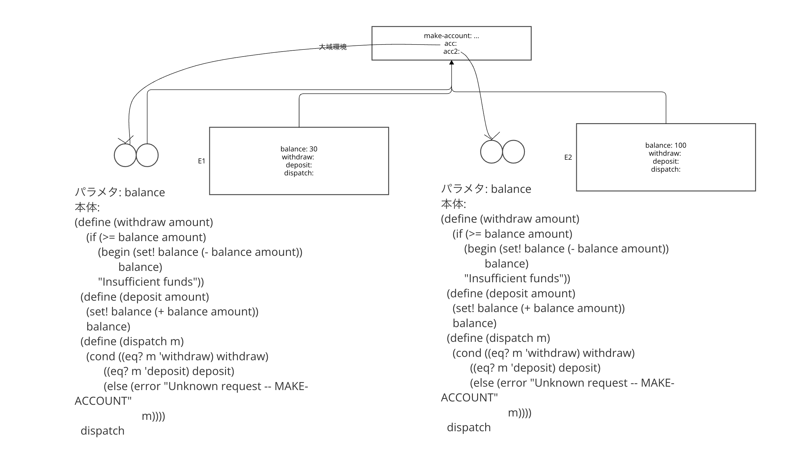

```racket
(define (make-account balance)
  (define (withdraw amount)
    (if (>= balance amount)
        (begin (set! balance (- balance amount))
               balance)
        "Insufficient funds"))
  (define (deposit amount)
    (set! balance (+ balance amount))
    balance)
  (define (dispatch m)
    (cond ((eq? m 'withdraw) withdraw)
          ((eq? m 'deposit) deposit)
          (else (error "Unknown request -- MAKE-ACCOUNT"
                       m))))
  dispatch)

(define acc (make-account 50))

((acc 'deposit) 40)
; 90

((acc 'withdraw) 60)
; 30
```

(define acc (make-account 50))の評価結果



((acc 'deposit) 40)の評価結果



((acc 'withdraw) 60)の評価結果



(define acc2 (make-account 100))の評価結果



accとacc2は大域環境のみを共有する