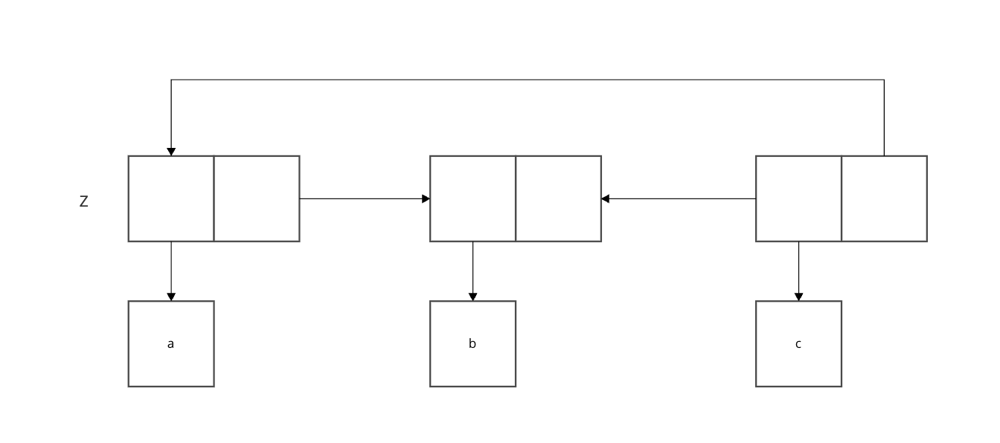

```racket
#lang sicp

(define (append x y)
  (if (null? x)
      y
      (cons (car x) (append (cdr x) y))))

(define (append! x y)
  (set-cdr! (last-pair x) y)
  x)

(define (last-pair x)
  (if (null? (cdr x))
      x
      (last-pair (cdr x))))

(define (make-cycle x)
  (set-cdr! (last-pair x) x)
  x)

(define z (make-cycle (list 'a 'b 'c)))

z
; #0=(a b c . #0#)

(last-pair z)
; 無限ループした
```

終端のnilがないため無限にlast-pairを実行し続けてしまう
