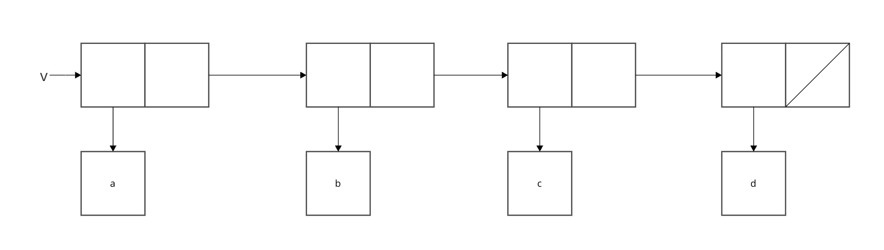
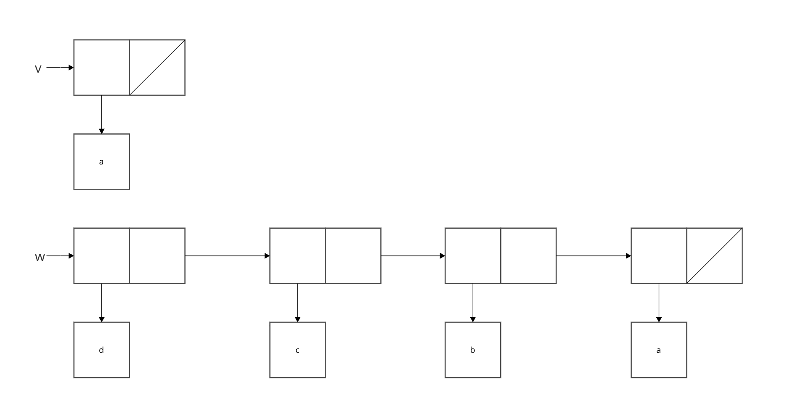

```racket
#lang sicp

(define (append x y)
  (if (null? x)
      y
      (cons (car x) (append (cdr x) y))))

(define (append! x y)
  (set-cdr! (last-pair x) y)
  x)

(define (last-pair x)
  (if (null? (cdr x))
      x
      (last-pair (cdr x))))

(define (make-cycle x)
  (set-cdr! (last-pair x) x)
  x)

(define (mystery x)
  (define (loop x y)
    (if (null? x)
        y
        (let ((temp (cdr x)))
          (set-cdr! x y)
          (loop temp x))))
  (loop x '()))

(define v (list 'a 'b 'c 'd))

(define w (mystery v))

v
; (a)

w
; (d c b a)
```

mysteryはlistを逆順にする手続きである。


### 束縛時のv



### 評価後のvとw



最初の(set-cdr! x y)の評価で、vがxに使われるため、cdrに空リストが入り、(a)となる。

2回目以降のloopはtempにxのcdrが入り、xのcarをloopのyとして渡し、それがcdrに入り続けることで逆順になる。