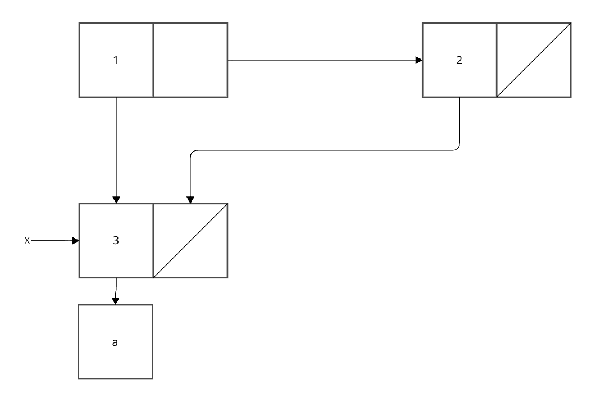

```racket
(define (count-pairs x)
  (if (not (pair? x))
      0
      (+ (count-pairs (car x))
         (count-pairs (cdr x))
         1)))
```

## count-pairsが3になったケース


```racket
(count-pairs (cons (cons 'a 'b) (cons 'c 'd)))
```

## count-pairsが4になるケース


xという対を共有しているが、それを重複して数えてしまっている

```racket
(define x (list 'a))
(count-pairs (list x x))
```

## count-pairsが7になるケース


yを共有しているが、consとcdrでそれぞれ重複して

```racket
(define y (cons 'a 'b))

(define y3 (cons y y))

(define y7 (cons y3 y3))

(count-pairs y7)
```