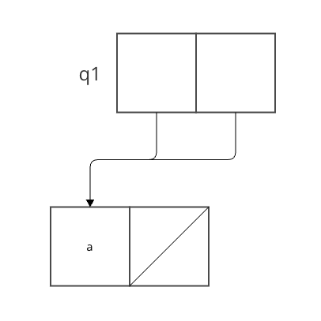
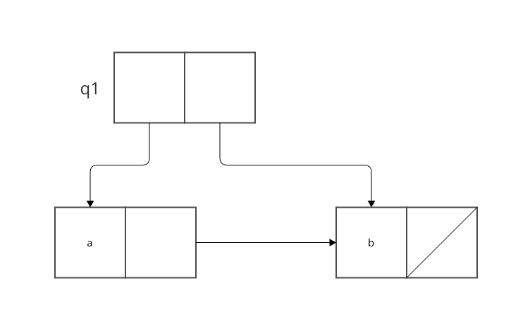
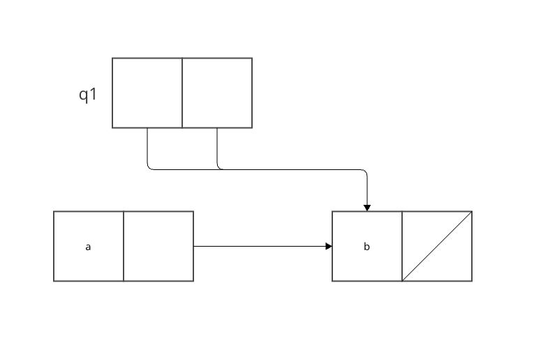
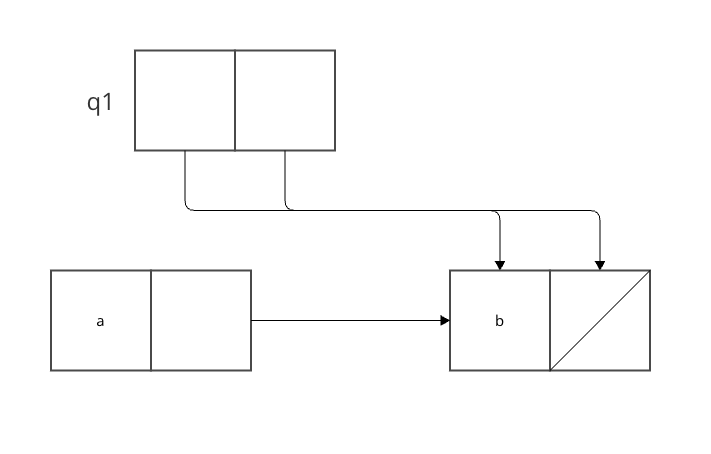

`(insert-queue! q1 'a)`


`(insert-queue! q1 'b)`


`(delete-queue! q1)`


delete-queueの実装はfront-ptrのみを変更する手続きである。
そのためreal-ptrに設定されているbは残る。

```racket
(define (delete-queue! queue)
  (cond ((empty-queue? queue)
         (error "DELETE! called with an empty queue" queue))
        (else
         (set-front-ptr! queue (cdr (front-ptr queue)))
         queue))) 
 ```

`(delete-queue! q1)`
