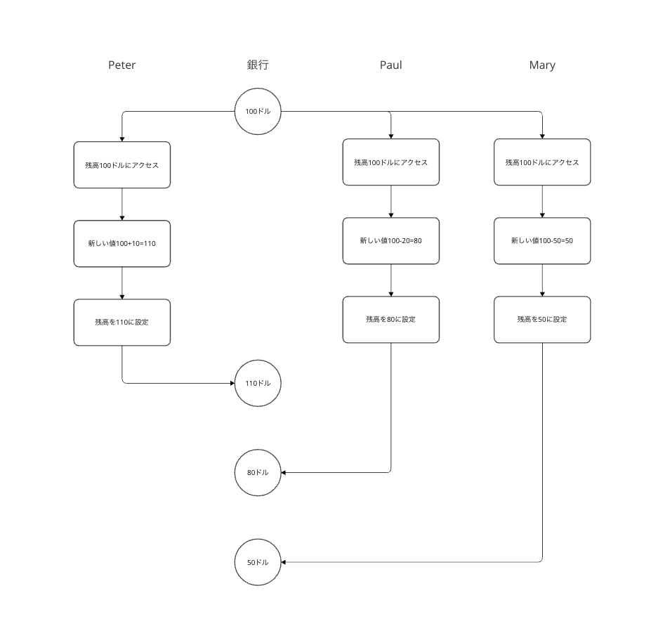
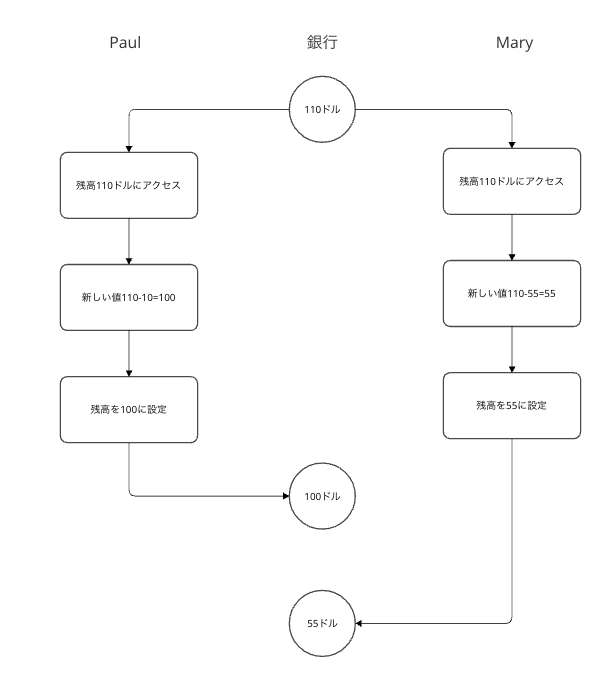
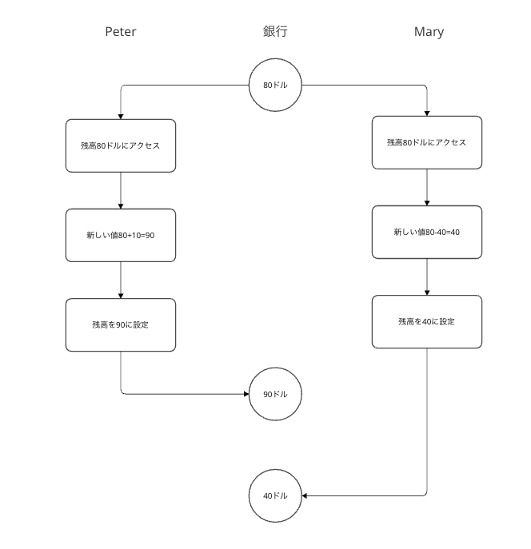
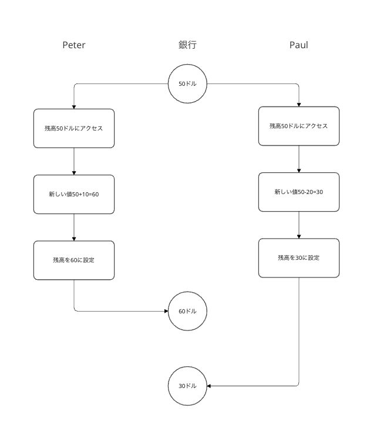

## a

balanceの取りうる値

pe: Peter
pa: Paul
ma: Mary

* 45
  * pe→pa→ma
  * pa→pe→ma
* 35
  * pe→ma→pa
* 50
  * pa→ma→pe
* 40
  * ma→pe→pa
  * ma→pa→pe

## b

### 3つ同時にプロセスが走った場合
* 110
* 80
* 50

### Peterの処理だけが早く終わった場合
* 100
* 55

### Paulの処理だけが早く終わった場合
* 90
* 40

### Maryの処理だけが早く終わった場合
* 60
* 30

