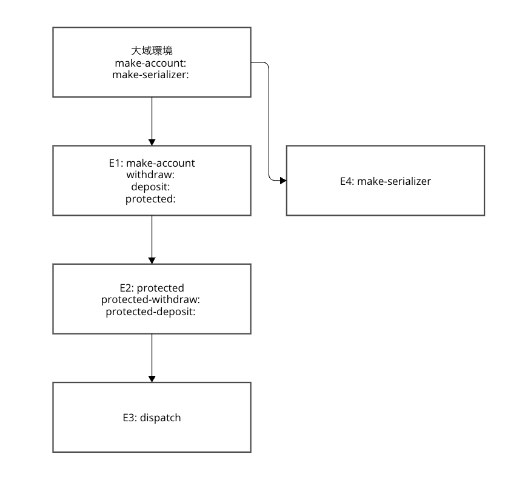
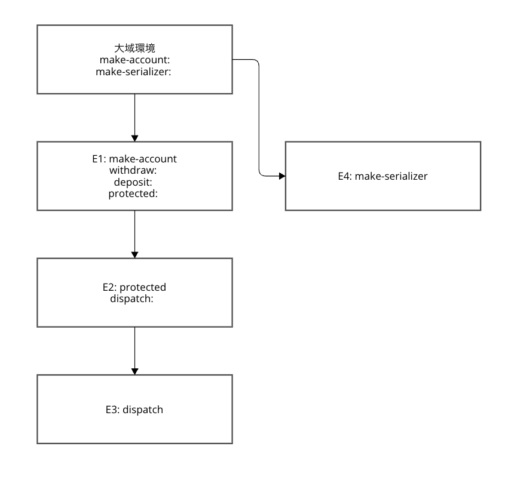

どちらもprotectedを共有していて、実行される手続きも変わりがないため安全かつ並列性にも違いはない。

```racket
(let ((protected (make-serializer)))
    (let ((protected-withdraw (protected withdraw))
          (protected-deposit (protected deposit)))
      (define (dispatch m)
        (cond ((eq? m 'withdraw) protected-withdraw)
              ((eq? m 'deposit) protected-deposit)
              ((eq? m 'balance) balance)
              (else (error "Unknown request -- MAKE-ACCOUNT"
                           m))))
    )
)
```

はシンタックスシュガーを剥がすとこんな感じ。

```racket
((lambda (protected)
   ((lambda (protected-withdraw protected-deposit)
      ((lambda (dispatch)
         dispatch)
       (lambda (m)
         (cond [(eq? m 'withdraw) protected-withdraw]
               [(eq? m 'deposit)  protected-deposit]
               [(eq? m 'balance)  balance]
               [else (error "Unknown request -- MAKE-ACCOUNT" m)]))))
    (protected withdraw)
    (protected deposit)))
 (make-serializer))
```

環境モデルにすると、3.42のバージョンはこんな感じ。



他方本文の方はこんな感じになる。

```racket
#lang racket
((lambda (protected)
   (lambda (m)
     (cond ((eq? m 'withdraw) (protected withdraw))
           ((eq? m 'deposit)  (protected deposit))
           ((eq? m 'balance)  balance)
           (else (error "Unknown request -- MAKE-ACCOUNT" m)))))
 (make-serializer))
 ```

