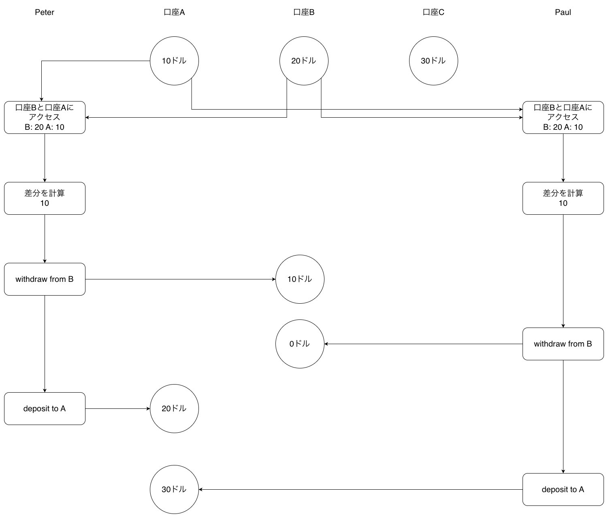
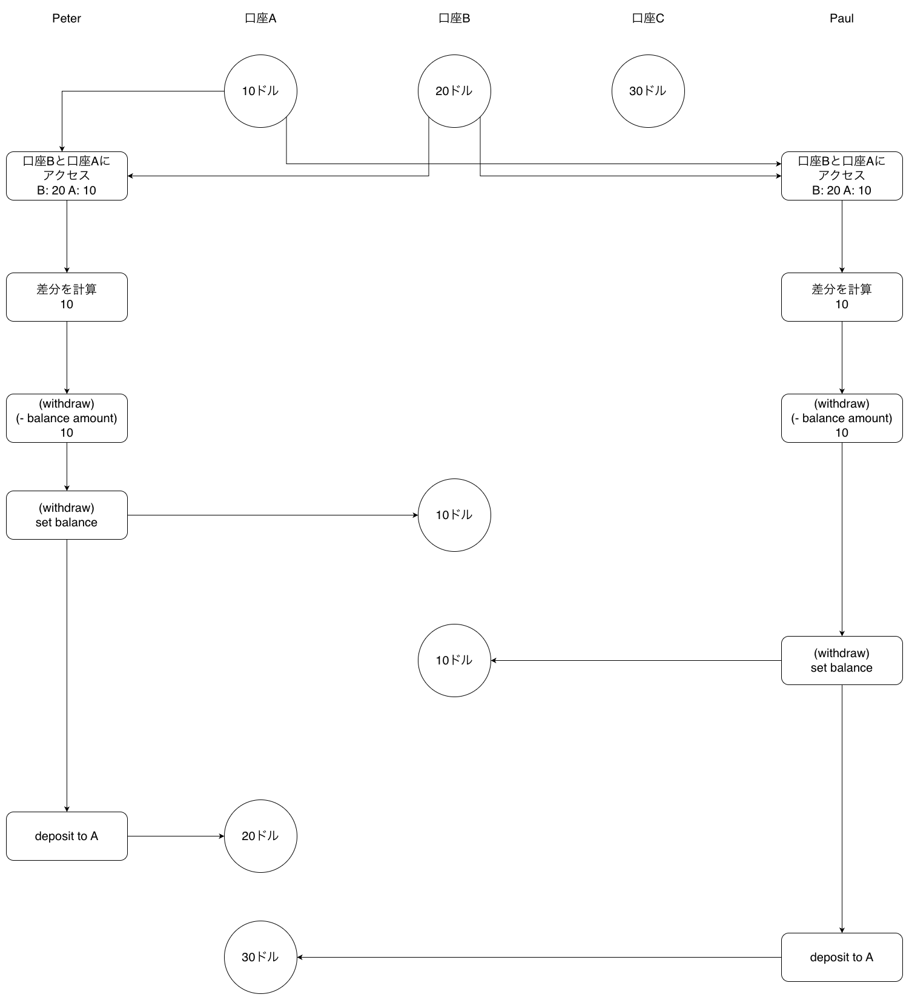

# 解答

## プロセスが逐次的に走る場合

逐次的にプロセスが走る場合、メソッド名の通り２つの口座間で金額を入れ替えるだけなので、[10, 20, 30] のリストを要素を並び替えるのに等しい。
その場合、ある順序で 10, 20, 30 となる。

## 最初の版を使った場合

withdraw と deposit のタイミングは直列化していないため、各口座への差分の反映タイミングがプロセスの処理タイミングによって異なる可能性がある。
一方で、withdraw や deposit の内部処理は直列化しているため、計算した差分の反映は正しく行われる。
すなわち、各口座への和と差の計算順序が入れ替わるだけなため口座の合計額については常に 60 となる。

## 取引を直列化していない場合

withdraw の内部処理が直列化されていない場合の図を示す。
withdraw の内部で (- balance amount) を行なっている。
Peter と Paul がそれぞれ処理をする時、Peter の withdraw の処理の set balance が行われる前に Paul が (- balance amount) で balance を参照すると、Peter の処理でマイナスされる前の値を参照することができてしまうので Peter の -10 の処理が反映されなくなるため、3 口座の合計が 10 増える結果となる。
