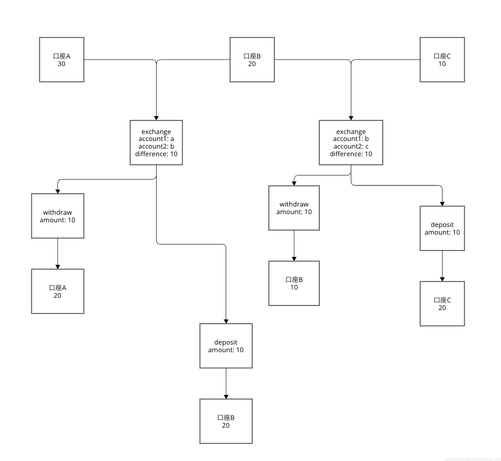
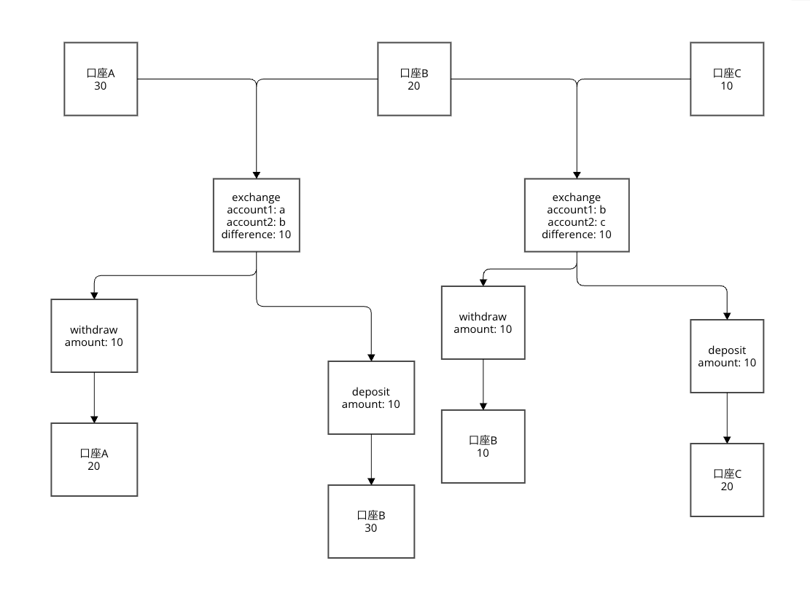

お金が増えるということはあってはならない雨、交換を逐次的に行えば10,20,30がそれぞれの口座にあるはずである。

しかし、exchangeが並行して処理された場合、口座Bが10に引き落とされたあと、10ドルの入金をされて全ての口座が20ドルとなる場合がある。

このパターンでは残高の合計は60ドルで変わらない。

各口座の取引が直列化されない場合は以下のようなパターンも起こりうる。

このパターンでは口座Bが10にセットされた後に口座Bをもとの20に10を足した30としてsetする手続きが入って合計が70になってしまう。

