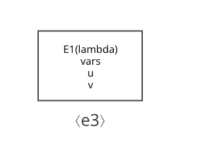
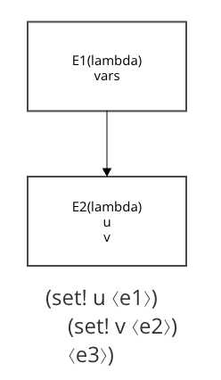

## 逐次解釈版

ここでは、E1環境でe3は評価される。

## 掃き出し版

ここでは、E2環境でe3は評価される。
letはlambdaのシンタックスシュガーであり、新たな手続きである。手続きを引数に作用させる時には新たな環境が作り出されることから、そのフレームができる。

しかし、u,vの値は実行時の親の環境に同じものがあるため違いは生じない。

このフレームを構成しないには、内部定義を先回りしてスキャンし、E1環境に変数として追加する。