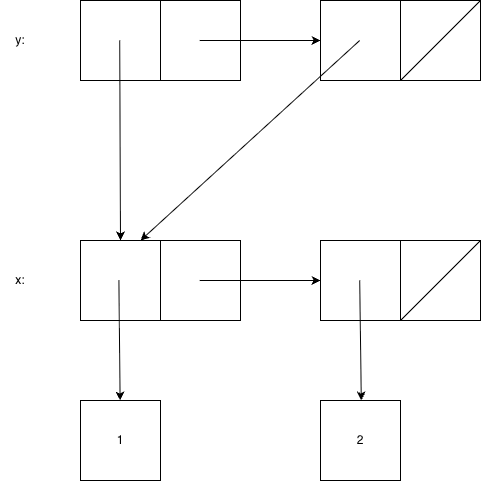

# 問題 5.20

対象の定義は次のとおり。

```scheme
(define x (cons 1 2))
(define y (list x x))
```

`free` ポインタの初期値は `p1` とする。

## 箱とポインタ図



図中の対は、次のように対応する。

- `x` は `p1` を指し、`p1` は `(1 . 2)` を表す。
- `y` は `p3` を指し、`p3` は先頭要素として `p1`、cdr として `p2` を持つ。
- `p2` も car として `p1` を持ち、cdr は空リスト `e0` である。

したがって、`y` の二つの要素はどちらも同じ対 `p1` を参照している。

## メモリーベクタ表現

| 添字 | the-cars | the-cdrs |
| --- | --- | --- |
| 1 | `n1` | `n2` |
| 2 | `p1` | `e0` |
| 3 | `p1` | `p2` |

ここで、`n1` と `n2` は数値 `1`、`2` への型付きポインタ、`e0` は空リストへのポインタを表す。

## 最終値

```text
x    = p1
y    = p3
free = p4
```

`cons` が3回行われ、`p1`、`p2`、`p3` を使用する。そのため、次の未使用位置を示す `free` は `p4` になる。
