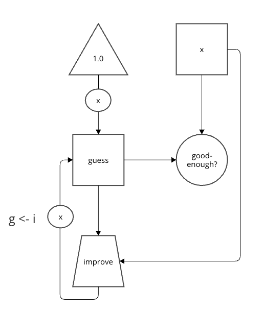
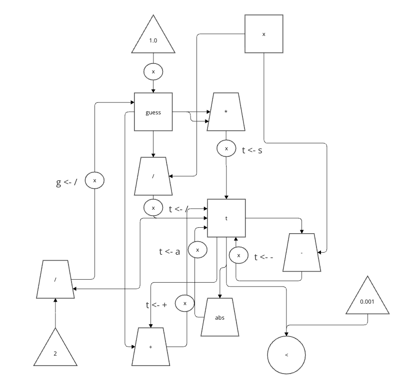

## 基本演算の版




```
(controller
　(assign guess (const 1.0))
  sqrt-iter
    (test (op good-enough?) (reg guess) (reg x))
    (branch (label sqrt-done))
    (assign guess (op improve) (reg guess) (reg x))
    (goto (label sqrt-iter))
  sqrt-done)
```

## 算術演算で展開する版



```
(controller
  (assign guess (const 1.0))
  sqrt-iter
    (assign t (op *) (reg guess) (reg guess))
    (assign t (op -) (reg t) (reg x))
    (assign t (op abs) (reg t))
    (test (op <) (reg t) (const 0.001))
    (branch (label sqrt-done))
    (assign t (op /) (reg x) (reg guess))
    (assign t (op +) (reg guess) (reg t))
    (assign guess (op /) (reg t) (const 2))
    (goto (label sqrt-iter))
  sqrt-done)
```